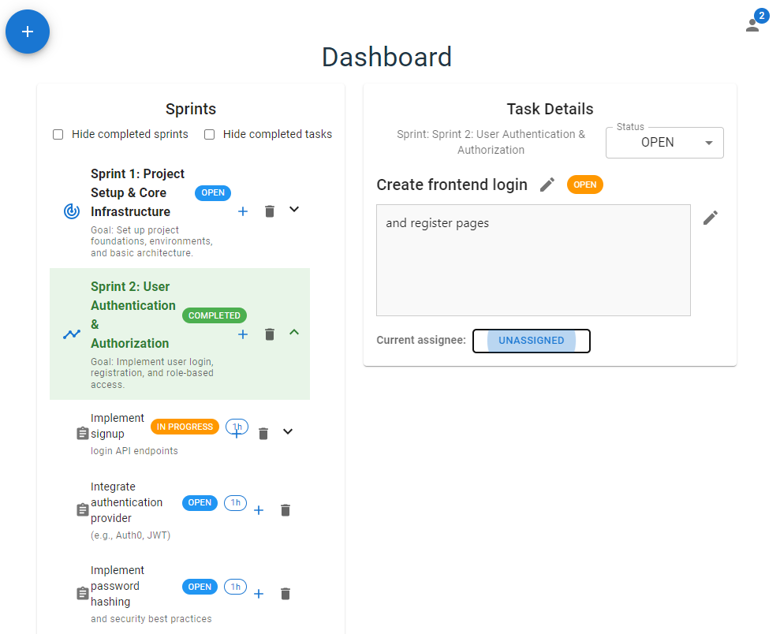

# SprintTogether

**SprintTogether** is a collaborative agile project sprint manager designed to help teams plan, track, and execute their sprints efficiently.

---

## Tech Stack

- **Backend:** Auth0, NestJS, PostgreSQL, Redis, Jest, Nginx
- **Frontend:** ReactJS, React Redux, MUI

---

## Project Setup & Testing

### 1. Create an Auth0 Account
Sign up for an [Auth0](https://auth0.com/) account.
On the Auth0 dashboard allow callback urls: http://localhost:3000/auth/callback
On the Auth0 dashboard allow logout urls: http://localhost:3000, http://localhost:80

Change "localhost" to your domain address if you are using one.

### 2. Add Environment Variables
- Create a `.env` file.  
- Refer to `.env.example` for guidance.  
- Place the `.env` file in the root directory of the project.

### 3. Start the Application
With docker:
```bash
docker compose up
```

Without docker
```bash
cd backend
npm install
npm run start
```

```bash
cd frontend
npm install
npm run dev
```


### 4. Behind the Scenes

The server issues JWT tokens to clients, if they have valid Auth0 authentication.  
Clients connect to the server using the JWT via HTTP cookies over WebSockets.  
Almost all communication is handled in real-time over WebSockets.
For all endpoints look at "Websocket DTO.html" or browse to /api/async-docs in development build.

Front end is ReactJS with Redux sitting at the heart. Components sub/unsub to websocket endpoints.
Updates are rarely optimistic. Since this is a collaborative/realtime tool, server authority over all.
E.g client sends task:update, server sends task:updated. Redux state changes. React redraws.


### 5. Monitoring

Open http://localhost:8080 to monitor the system, only accesible from the same network.